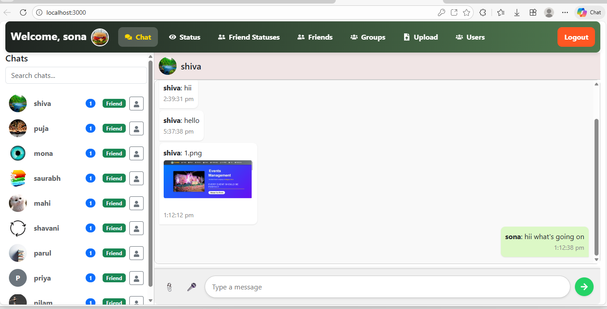
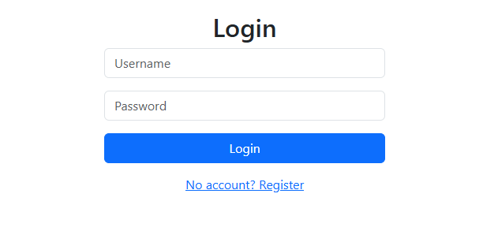
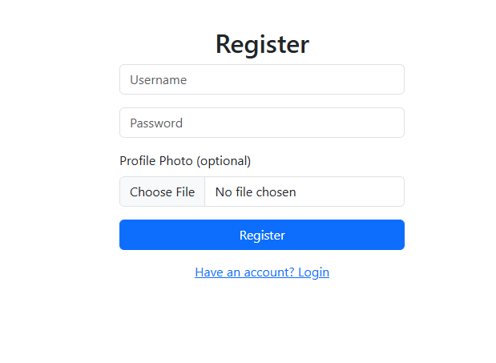
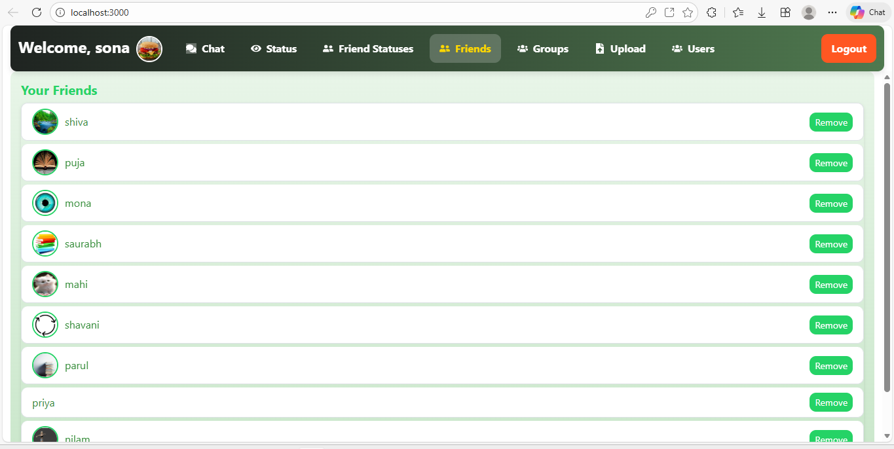

# 💬 Chat Application

A full-stack real-time chat application built with React and Spring Boot.

---

## 🛠️ Tech Stack

### Frontend
- **React.js** - User Interface
- **WebSocket** - Real-time messaging
- **Axios** - API calls

### Backend
- **Spring Boot** - Java framework
- **MongoDB** - Database
- **WebSocket** - Real-time communication
- **JWT** - Authentication

---

## ✨ Features

- 🔐 User Authentication (Login/Register)
- 💬 Real-time Messaging
- 👥 Group Chat
- 📸 Image & File Upload
- 📱 Status Updates
- 👤 User Profile Management

---

## 📷 Screenshots

### Homepage

### login Page

### Register Page

### Friends Page

## 📂 Project Structure
